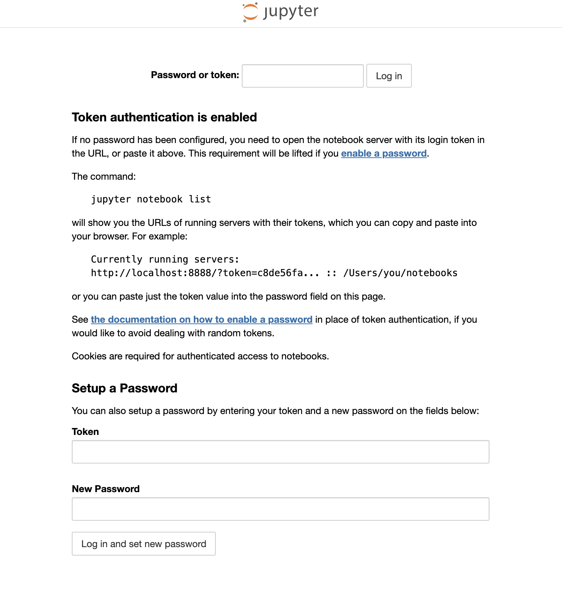

# :technologist: **Init the tools -> AI4Industry.**

## Intro.
Ce dépôt contient un tuto sur l'utilisation, et l'installation des outils de base pour faire de l'IA.

Vu en cours, code CNAM `USRS6V`.

## :package: Logiciels requis.
`Docker` est nécessaire pour suivre ce tuto. Ou alors un PC sous une distribution Linux, mais ici le tuto est adapté sous `Docker`. Il faudrat juste penser à adapter quelques commandes, suivant les cas.

Pour l'installer [par ici !](https://www.docker.com/)

## :boom::boom: Création du conteneur.
On crée un conteneur, et on ajouter le port `8888` pour pouvoir accéder au serveur `Jupyter` depuis la machine hôte (on vera la partie `Jupyter` un peu plus tard).
```bash
docker run -it --name init_ai4industry -p 8888:8888 ubuntu
```

Le terminal que vous utilisez va automatiquement basculer sur le conteneur. A noter que vous entrez donc sur une image ubuntu, en compte utilisateur `root`, donc la commande `sudo`est inutile ici !

On commence par mettre à jour la distribution.
```bash
apt update
apt upgrade
```

Nous voulons utiliser `python 3.7`, donc nous devons ajouter le dépôt qui contient les anciennes version de `Python`.
```bash
apt install software-properties-common
add-apt-repository ppa:deadsnakes/ppa

apt install python3.7 python3.7-venv
```

### :memo: Création de notre environnement de travail.
Nous allons juste créer un environnement virtuel `Python`, dans un dossier bien à part. Voici les commandes :
```bash
cd home/ubuntu
mkdir workspace_ia
cd workspace_ia
```

Dans ce dosier nous allons créer notre environement `Python`. Nous utilisons ici la version `3.7`.
```bash
python3.7 -m venv venv
source venv/bin/activate
```

Maintenant, installons les bibliothèques (le téléchargement peut prendre un peu de temps).
```bash
pip install jupyter==1.0.0 matplotlib
```

## :rocket: Lancement de `Jupyter`.
Ok tout est installé, démarons `Jupyter`. Il faut juste penser, étant donner que nous sommes dans un conteneur, à changer l'`ip`, et le `port`. De plus nous sommes connecter en tant que `root`, et `Jupyter` a donc besoin d'un argument en plus pour autoriser l'éxecution.
```bash
jupyter notebook --allow-root --ip='0.0.0.0' --port=8888
```

Voilà, sauf erreur, `Jupyter` devrait indiquer un lien, avec dedans un `token`. Sous cette forme :
```bash
http://127.0.0.1:8888/?token=<le_token_en_question>
```
Il faudrait copier ce fameux `token`, garder le dans le presse papier.

Maintenant ouvrons un navigateur, et entrez l'`url` suivante : [http://127.0.0.1:8888](http://127.0.0.1:8888)

Normlement vous arrivez sur une page comme celle-ci :
<div style="width : 80%">
    
</div>

En bas on peut voir deux champs, dans le premier il faut coller le `token`, et dans le deuxième il faut créer un mot de passe.

Il suffit ensuite de confirmer, et le mot de passe vous sera redemandé.


# :fire: Vous pouvez commencez.
Tous est instalé, vous pouvez importez depuis `Jupyter` les `notebook` stocké dans ce dépôt, ils sont commenter et décrit, pour une meilleur comphrénsion.

Pour importer, il faut sur rendre sur la page d'accueil, ensuite appuyez sur le bouton `upload`.